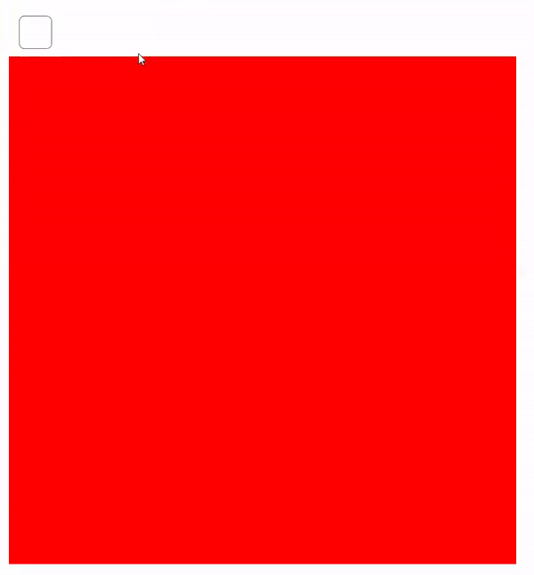

# 200s-javascript-prov första JavaScript provet
## Regler
* Inte tillåtet att hjälpa varandra på något sätt, räknas som fusk.
* Det är tillåtet att använda internet hur mycket man vill.
* Efter provet kan ni skicka in era svarsfiler som DM till mig via Teams.
Vet ni hur man zippar så får ni zippa mappen med filerna.<br><br>

Börja med att klona eller ladda ner projektet.
<br>
`git clone https://github.com/abbjetmus/200s-javascript-prov.git`
<br>
## Att tänka på

Varje fråga består av en html fil med uppgiftsnumret.<br>
Html filen innehåller en html mall med nödvändiga taggar och en ```script``` tagg där ni ska lägga in er javascript kod.<br>
För att starta programmet dubbel-klickar du bara på html filen i filutforskaren och den öppnas i webbläsaren. Sedan när du gör ändringar i filen laddar du om webbläsaren för att dina ändringar ska synas.
Du får använda valfri editor för att koda men rekommenderar Visual Studio Code.

## Fråga 1 - Variabler
Skapa två variabler firstName och lastName som du tilldelar ditt förnamn och efternamn till. Skriv ut ditt hela namn till konsolen med hjälp av konkateneringsopreatorn + så att utskriften blir ”Jeton Mustini” men med ert namn.


## Fråga 2 - Datatyper
Namnge 4 stycken datatyper i JavaScript. Om du vill testa dig fram använd typeof( ) funktionen.


## Fråga 3 - Operatorer
Använd 4 operatorer med två tal och tilldela dem till en variabel för varje operator. Skriv sedan ut resultatet. Jag visar ett exempel med rest-operatorn, sen gör ni samma sak med de andra operatorerna. let rest = 5%2 console.log(rest)


## Fråga 4 - Villkor
Deklarera en variabel age som du läser in från användaren med ```promt()``` funktionen.<br> 
Skapa sedan en if-else-sats som kollar om åldern är under 16 år, är den det skriver du ut ”Tyvärr du får inte börja övningsköra!” annars skriver du ut ”Du får börja övningsköra!”.

## Fråga 5 - For-loopen
Skriv en for-loop som börjar vid talet 5 och skriver ut alla talen upp till 20.

## Fråga 6 - Funktioner
Skriv två funktioner, en funktion multiplicera( ) som multiplicerar två tal och en funktion dividera( ) som dividerar två tal, båda funktionerna ska returnera resultatet. Anropa sedan båda funktionerna en gång med två valfria tal och skriv ut resultatet till konsolen.

## Fråga 7 - Objekt
Skapa ett objekt som heter plats med följande properties egenskaper: address: ”Robotvägen 24” zipcode: ”722 24” city: ”Västerås” Ändra sedan på objektets city till Ludvika. Skriv sedan ut hela objektet till konsolen.

## Fråga 8 - Array/Lista
Skapa en array med siffrorna 1 till 10. Skriv sedan ut talet 5 med hjälp av arrayen dvs använd rätt index för att få ut talet 5. Skapa sedan en for-loop som loopar igenom arrayen och skriver ut varje tal till konsolen. Använd length för att få arrayens längd.

## Fråga 9 - Html +  JavaScript
1. Du har en input tagg av typen checkbox.
2. Läs in checkboxen med JavaScript och varje gång den bockas respektive av-bockas ska bakgrundsfärgen ändras på div-taggen under.
3. Du kan applicera css-klasserna i styles-taggen innanför head-taggen som heter "backgroundGreen", och "backgroundRed".
```
    <style>
        .backgroundGreen {
            background-color: green;
        }

        .backgroundRed {
            background-color: red;
        }
    </style>
```
klasserna ska sätta background-color till red respektive green.
```
<div style="width: 200px; height: 200px;"></div>
```
<b>Byt ut taggen mot en knapp vilket är lättare om checkbox är för svårt. Eller gör båda för övningens skull.</b>

### Resultat

