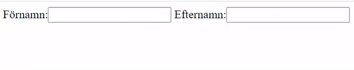
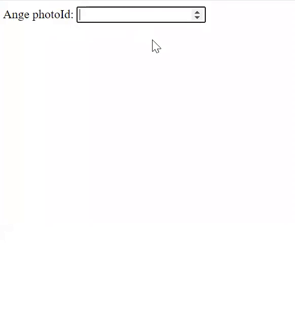
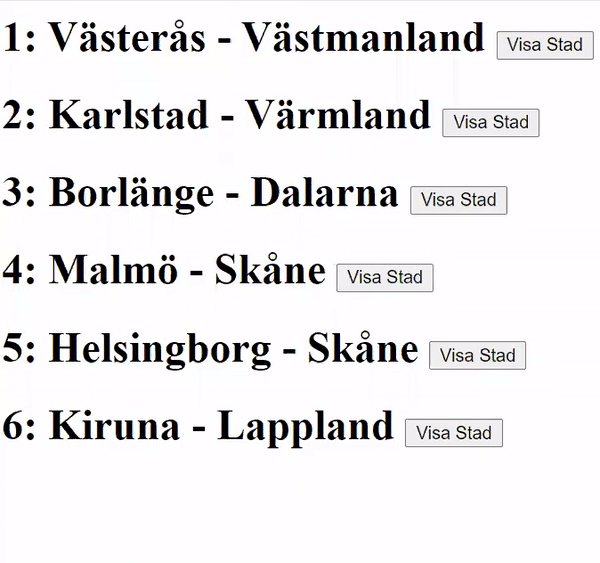
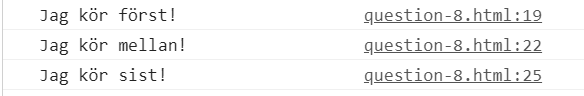

# vue-exercieses

## Regler
* Inte tillåtet att hjälpa varandra på något sätt, räknas som fusk.

* Efter provet kan ni skicka in era svarsfiler som DM till mig via Teams.
Vet ni hur man zippar så får ni zippa mappen med filerna.<br><br>

Börja med att klona eller ladda ner projektet.
<br>
`git clone https://github.com/abbjetmus/Vue-Prov-180S-2021-01-11.git`
<br>
## Att tänka på

1. Använd back-ticks **\` \` (shift + `)** om du vill ha html över flera rader i en komponent.
```
var testcomponent = {
       template: `
           <div>
              <p></p>
           </div>
          `
       }
```
2.	Använd små bokstäver på komponent-namn och event/metoder.

## Fråga 1 - Interpolation

### Swedish
Skapa ett data objekt som heter **address** som innehåller variablerna/properties **gata**, **postnummer** och **stad**. Objektets variabler/properties ska innehålla värden på din egna post-address.<br>
Skriv sedan ut texten *Jag bor på Fregattvägen 7A, 749 48 Enköping* med hjälp av ditt address objekt.

### English
Create a data object called address that contains the variables/properties **street**, **postcode** and **city**. The object's variables / properties must contain values ​​for your own postal address.<br>
Then print the text *I live on Fregattvägen 7A, 749 48 Enköping* using your address object.

### Resultat
**Jag bor på Fregattvägen 7A, 749 48 Enköping**<br><br>

## Fråga 2 - Loopa

### Swedish
1. Skapa en data variabel med namnet **cities** som är en **array [ ]** och innehåller tre objekt med städer:

```
{id: 1, name: 'Västerås', county: 'Västmanland'},
{id: 2, name: 'Karlstad', county: 'Värmland'},
{id: 3, name: 'Borlänge', county: 'Dalarna'}
```

2. Loopa sedan igenom arrayen med städer i en html lista där du skriver ut *namnet - bindestreck länet*,<br>
du väljer själv om du vill använda <**ul**> unorderd-list eller <**ol**> ordered-list.

### English
1. Create a data variable named **cities** which is a **array[ ]** and contains three objects with cities:

```
{id: 1, name: 'Västerås', county: 'Västmanland'},
{id: 2, name: 'Karlstad', county: 'Värmland'},
{id: 3, name: 'Borlänge', county: 'Dalarna'}
```

2. Then loop through the array of cities in an html list where you print *name - hyphen county*,<br>
you choose whether you want to use <**ul**> unorderd-list or <**ol**> ordered-list.

### Resultat
* Västerås - Västmanland
* Karlstad - Värmland
* Borlänge - Dalarna

## Fråga 3 – Två-vägs-bindning (Two-way-binding)
### Swedish
1. Skapa två inmatningsfält, en för förnamn och en för efternamn med hjälp av **input**-taggen.
2. Använd två-vägs-bindning för att binda inmatningsfälten till två data variabler.
3. Visa sedan resultatet som fullständigt namn med valfria taggar.

### English
1. Create two input fields, one for firstname and one for lastname using the **input** tag.
2. Use two-way binding to bind the input fields to two data variables.
3. Then display the result as a fullname with optional tags.

### Resultat


## Fråga 4 – Watch 
### Swedish
1. Skapa en data variabel med namnet **id**:
2. Skapa en Watcher som lyssnar på **id** variabeln.
2. Skapa ett inmatningsfält med **input**-taggen. 
3. Fältet ska kunna ta in en siffra och två-vägs-binda med hjälp av v-model till **id** variabeln.
5. Använd sedan följande *fetch*-anrop i din watcher för att hämta ner ett photo med hjälp av **id:t**, du måste alltså lägga till id:t i anropet t.ex. *'https://jsonplaceholder.typicode.com/photos/1'* där id = 1. Bra att kolla först att id har ett värde också.
```
fetch('https://jsonplaceholder.typicode.com/photos/')
  .then(response => response.json())
  .then(json => console.log(json))
```
6. Titta på datats typer i webbläsarens konsol. Eller på länken ovan.
7. Lagra sedan datat i en data variabel som heter **photo**.
8. Presentera **photo** i html:en med lämpliga taggar.

### English
1. Create a data variable named **id**:
2. Create a Watcher that listens to the **id** variable.
2. Create an input field with the **input** tag.
3. The field must be able to enter a number and two-way bind using v-model to the **id** variable.
5. Then use the following *fetch* method in your watcher to download a photo using the **id**, you must add the id to the call e.g.
*'https://jsonplaceholder.typicode.com/photos/1'* where id = 1. It is good to first check that id has a value as well.
### Resultat


## Fråga 5 – Style bindning
### Swedish
Du har fått en div-tagg med en t-shirt som bakgrundsbild. Under den finns det 4 knappar **buttons**.<br>
Din uppgift är att byta färg på t-shirten till den färgen som står på knappen när man klickar på den.
Detta görs genom att byta bakgrundsfärg på div-taggen.
1. Skapa en data variabel som heter **color**.
2. När man klickar på en knapp ska color uppdateras till den färgen.
3. Använd style-binding på div-taggen så att den binder till color data-variabeln och sätter bakgrundsfärgen.

### English
You have received a div tag with a t-shirt as a background image. Below it there are 4 buttons **buttons**.<br>
Your task is to change the color of the t-shirt to the color that is on the button when you click on it.
This is done by changing the background color of the div tag.
1. Create a data variable called **color**.
2. When you click a button, color should be updated to that color.
3. Use style binding on the div tag so that it binds to the color data variable and sets the background color.
### Resultat


## Fråga 6 – Slots 

### Swedish
1. Skapa en komponent som heter **postcomponent**. 
2. **postcomponent** ska ha två namngivna slots med namnen "title" och "description".
**title** sloten ska vara en <**h1**> tagg och **description** sloten ska vara en <**p**> tagg.
3. Använd sedan **postcomponent** i '#app'-komponenten och skicka in två <**div**> taggar via slotsen med texten *"Det här är en titel"* och *"Det här är en beskrivningen"*.

### English
1. Create a component named **postcomponent**.
2. **postcomponent** shall have two named slots named "title" and "description".
**title** slot should be a <**h1**> tag and **description** slot should be a <**p**> tag.
3. Then use **postcomponent** in the '#app'-component and submit two <**div**> tags via the slots with the text *"This is a title"* and *"This is a description"*.

### Resultat

### Det här är en titel
Det här är en beskrivningen


## Fråga 7 – Komponent kommunikation
### Swedish
1. Skapa en data variabel med namnet **cities** som är en **array [ ]** och innehåller fem objekt med städer:

```
{id: 1, name: 'Västerås', county: 'Västmanland'},
{id: 2, name: 'Karlstad', county: 'Värmland'},
{id: 3, name: 'Borlänge', county: 'Dalarna'},
{id: 4, name: 'Malmö', county: 'Skåne'},
{id: 5, name: 'Helsingborg', county: 'Skåne'},
{id: 6, name: 'Kiruna', county: 'Lappland'},
```

Skapa också en variabel som heter **selectedCity**<br>

2. Skapa sedan en komponent som heter **cityitem** som tar in en stad som props.
**cityitem** visar stadens namn tillsammans med en knapp bredvid.<br>
3. När man klickar på knappen ska staden skickas till parent komponenten (app-komponenten) och tilldelas till
selectedCity.<br>
4. **selectedCity** ska sedan visas i html med all information.

### English
1. Create a data variable named **cities** which is a **array[ ]** and contains five objects with cities:

```
{id: 1, name: 'Västerås', county: 'Västmanland'},
{id: 2, name: 'Karlstad', county: 'Värmland'},
{id: 3, name: 'Borlänge', county: 'Dalarna'},
{id: 4, name: 'Malmö', county: 'Skåne'},
{id: 5, name: 'Helsingborg', county: 'Skåne'},
{id: 6, name: 'Kiruna', county: 'Lappland'},
```

Also create a variable named **selectedCity** <br>

2. Then create a component called **cityitem** that takes in a city as props.
**cityitem** displays the city name along with a button next to it. <br>
3. When you click on the button, the city should be sent to the parent component (app component) and assigned to
selectedCity. <br>
4. **selectedCity** should then be displayed in html with all information.

### Resultat


## Fråga 8 – Life-cycle-hooks
### Swedish
1. Skapa 3 stycken olika life-cycle-hooks.
2. Beroende på vilken ordning som de körs när en vue-komponent laddas in i webbläsaren skriv ut från life-cycle-hooken till konsolen<br><br>
*Jag körs först!*<br>
*Jag körs mellan!*<br>
*Jag körs sist!*<br><br>

Använder du en life-cycle hook som inte körs när komponenten skapas räcker det med att den finns i koden.

## English
1. Create 3 different life-cycle hooks.
2. Depending on the order in which they run when a vue component is loaded in the browser, print from the life-cycle hook to the console <br> <br>
*I go first!* <br>
*I go second!* <br>
*I go last!* <br> <br>

If you use a life-cycle hook that does not run when the component is created, it is sufficient that it is in the code.
### Resultat


